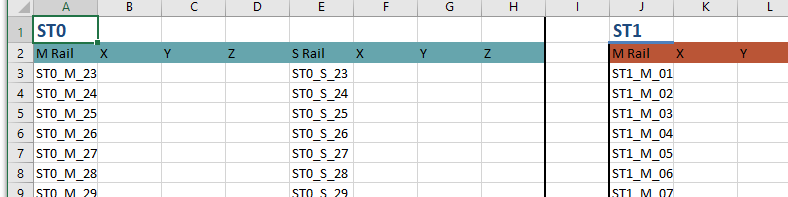

## OpenPyXL Measurement Template Generator

Based off an input excel sheet, generates an `xlsx` as required for industry-specific use. 

### Usage

1. Install [Python](https://www.python.org/downloads/)
    * Make certain that the `Install to Path` checkbox available during the installation is **checked**. 
2. Grab the `generate_excel.py` script and the `template.xlsx` files I've attached alongside this mail.
3. To generate an excel sheet, update the template excel (`User Input` sheet) to the station numbers you want. 
4. Open up a command line window, `cd` to the directory containing both the template and the python script.
5. In the command line, run the following command `python generate_excel.py`
	* As a **one-time** step before running this script for the first time, you need to run the following command on the command line `pip install openpyxl`
6. Look in the folder alongside the script. There will be a `generated_xxxx` file that contains the templates.

### Results

### Compatibility

Python 3.7+. My users install latest Python as required. Not worth to maintain back-compat.
